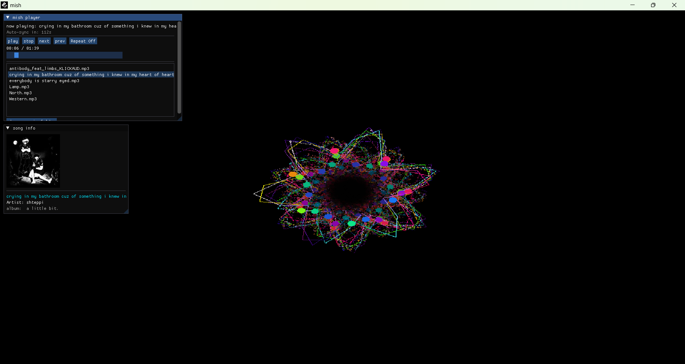

<div align="center">

```
           _     _     
 _ __ ___ (_)___| |__  
| '_ ` _ \| / __| '_ \
| | | | | | \__ \ | | |
|_| |_| |_|_|___/_| |_|
```

# mish 🎵


**mish (C) 2026 by josh**


</div>

---

> a minimalist music player, designed as a love letter to the 2000s.

mish is a small, lightweight music player focused on simplicity, nostalgia, and looking cool while doing it.

⚠️ mish is currently in early beta. Expect bugs, weirdness, and unfinished features + i coded this a while ago, so unsure

---

## ✨ Features

- 🎨 sick ass visuals
- 🖼️ automatic album art detection
- 📂 playlist support
- 🔍 automatic music folder scanning
- 🎧 MP3 / WAV / OGG support
- 🧊 FLAC support *(experimental)*
- 💾 remembers your settings
- 🖥️ lightweight desktop app

---

## 📸 Screenshots

<p align="center">

</p>

---

## 🚀 Getting Started

### First launch

mish has a first-time setup wizard.

when opening mish for the first time:

1. choose your music folder
2. let mish scan your library
3. enjoy your music ✨

---

## 🎮 Controls

| Action | Key |
|-|-|
| Play/Pause | Space |
| Next song | → |
| Previous song | ← |
| Volume | Mouse |

*(update this section when controls are finalized)*

---

## 📁 Important Files

please do not delete:

```
imgui.ini
mish_config.txt
```

these files store things like:

- playlist data
- settings
- automatic scanning information

---

## 🛠️ Roadmap

things planned for future versions:

- [ ] better playlist management
- [ ] more visual effects
- [ ] improved album art handling
- [ ] equalizer
- [ ] customizable themes
- [ ] more audio formats
- [ ] Linux support

---

## 🐛 Known Issues

because mish is still beta:

- FLAC support may be unstable
- some album art may not be detected
- playlists/settings may change between versions

---

## 💙 Credits

made by **josh**

mish is a personal project built out of love for winamp.

thanks for trying it :)

---

## 📜 License
mish is licensed under the GNU General License v3.
see [LICENSE.TXT](license.txt) for details :P
